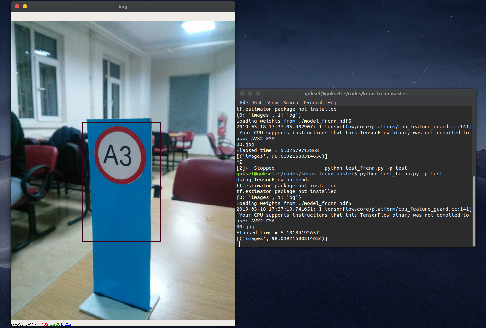

# keras-frcnn
Keras implementation of Faster R-CNN: Towards Real-Time Object Detection with Region Proposal Networks.
Cloned from https://github.com/kbardool/keras-frcnn and https://github.com/yhenon/keras-frcnn/

USAGE:
`train_frcnn.py` can be used for training. I used dataset I prepared myself.
`python train_frcnn.py -p /path/to/train_data/`.

simple_parser.py provides an alternative way to input data, using a text file. Simply provide a text file, with each line containing:
  `filepath,x1,y1,x2,y2,class_name`
  
You can use this script https://github.com/gokseltokur/coordinatesofimage to prepare your own dataset label (text). It is easy way.

The classes will be inferred from the file. To use the simple parser instead of the default pascal voc style parser, use the command line option `-o simple`. For example `python train_frcnn.py -o simple -p my_data.txt

- test_frcnn.py can be used to perform inference, given pretrained weights and a config file. Specify a path to the folder containing
images:
    `python test_frcnn.py -p /path/to/test_data/`

Example outputs:

